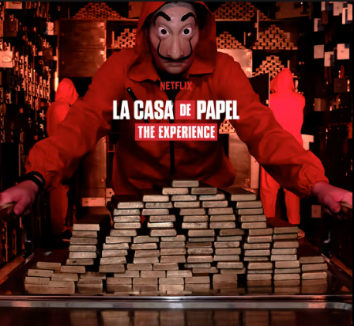
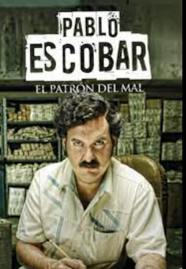

# Series de TV
##  Estas son algunas de mis series favoritas. 
* La casa de papel 👺
* Pablo Escobar 🤑
* Vikingos 👲
* Merlina 🧛‍♂️🧟‍♀️
### ¿Porque me gustan estas series ?

La que mas me gusto fue la casa de papel ya que trata de un misterioso hombre conocido como el ¨Profesor¨ ha pasado toda su vida planeando el mayor de los atracos de la historia: entrar en la Fábrica Nacional de Moneda y Timbre e imprimir 2400 millones de euros, 
 me gusta la accion que hay detras de estas series y la adrenalina que sienten los 
personajes la transmiten al publico, en como planifican los robos, reuniones sercretas,
etc.

***Vinculo que utilize*** [Wikipedia](https://es.wikipedia.org/wiki/La_casa_de_papel)

   

